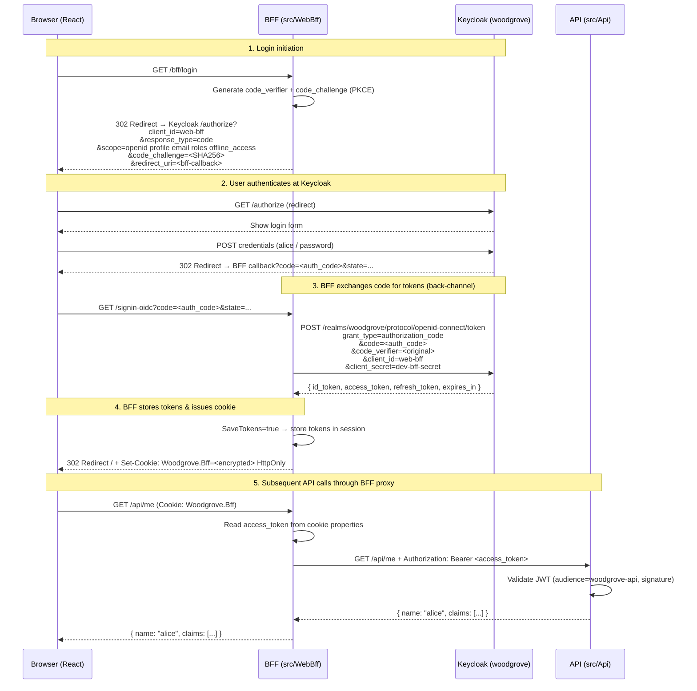

# OAuth2 / OIDC / SSO Cheatsheet
## Woodgrove Demo Study Notes

> Concrete values from **this** project so abstract concepts map to real files you can open.

---

## 1. OAuth2 Roles & Grant Types

### The Four OAuth2 Roles

| Role | Generic Name | In This Project |
|------|-------------|-----------------|
| **Resource Owner** | The user who owns the data | `alice` or `bob` (password: `password`) |
| **Client** | App requesting access on behalf of the user | BFF (`web-bff` client in Keycloak) |
| **Authorization Server** | Issues tokens after the user authenticates | Keycloak — realm `woodgrove`, port `8080` |
| **Resource Server** | Hosts the protected data/API | `src/Api` — validates `Authorization: Bearer <token>` |

### Grant Types

| Grant Type | Use Case | Used Here? |
|-----------|---------|------------|
| **Authorization Code + PKCE** | Web apps, SPAs with a server component | Yes — BFF uses this |
| **Client Credentials** | Machine-to-machine (no user) | No (would use `serviceAccountsEnabled: true`) |
| **Device Code** | Devices without a browser (smart TV, CLI) | No |
| **Implicit** | Deprecated — tokens in URL fragment | No — never use |
| **Password / ROPC** | Dev/test only — send credentials directly | Disabled (`directAccessGrantsEnabled: false` in `woodgrove-realm.json`) |

---

## 2. OIDC vs OAuth2

| | OAuth2 | OIDC (OpenID Connect) |
|---|--------|----------------------|
| **Purpose** | Authorization — "can this app access resource X?" | Authentication — "who is this user?" |
| **Built on** | — | OAuth2 (adds identity layer) |
| **Token issued** | Access token (opaque or JWT) | ID token (always JWT) + access token |
| **Standard claims** | `iss`, `aud`, `exp` (minimal) | `sub`, `name`, `email`, `preferred_username`, etc. |
| **Discovery endpoint** | None | `/.well-known/openid-configuration` |

OIDC is OAuth2 **plus** an identity layer. When you request scope `openid`, Keycloak issues both an **ID token** (who the user is) and an **access token** (what the app can do).

### The Three Token Types

| Token | Purpose | Where it lives in this project |
|-------|---------|-------------------------------|
| **ID Token** | Proves identity to the client | Stored server-side (encrypted in an HttpOnly cookie; readable only server-side, never by JavaScript) in `Woodgrove.Bff` cookie properties via `SaveTokens = true`; accessible via `/bff/debug/tokens` (dev only) |
| **Access Token** | Sent to the API as `Bearer` proof | Also in cookie properties; YARP attaches it to every proxied request |
| **Refresh Token** | Exchange for a new access token when it expires | In cookie properties; `TokenRefresher.cs` uses it automatically |

The access token lifespan in this project is **300 seconds** (5 minutes), set in `woodgrove-realm.json` (`"accessTokenLifespan": 300`). `TokenRefresher.cs` refreshes when fewer than **1 minute** remain.

### JWT Anatomy

A JWT is three Base64url-encoded parts separated by dots:

```
header.payload.signature
```

**Header** — algorithm metadata:
```json
{
  "alg": "RS256",
  "typ": "JWT",
  "kid": "<key-id>"
}
```

**Payload** — claims. Example access token from this project:
```json
{
  "iss": "http://localhost:8080/realms/woodgrove",
  "aud": ["woodgrove-api", "account"],
  "sub": "a1b2c3d4-...",
  "preferred_username": "alice",
  "email": "alice@example.com",
  "roles": ["admin", "user"],
  "exp": 1735000000,
  "iat": 1734999700
}
```

**Key claims in this project:**

| Claim | Meaning | This Project |
|-------|---------|-------------|
| `iss` | Issuer — who created the token | `http://localhost:8080/realms/woodgrove` |
| `aud` | Audience — intended recipient | `woodgrove-api` (added by `audience-woodgrove-api` protocol mapper) |
| `sub` | Subject — stable user identifier (UUID) | User's Keycloak UUID |
| `preferred_username` | Human-readable username | `alice` or `bob` |
| `roles` | Custom flat claim — realm roles | `["admin","user"]` for alice, `["user"]` for bob |
| `exp` | Expiry timestamp (Unix epoch) | `iat + 300` |
| `iat` | Issued-at timestamp | When Keycloak issued the token |

**Signature** — `RS256(base64url(header) + "." + base64url(payload), private_key)`. The API verifies this using Keycloak's public key fetched from the JWKS endpoint.

---

## 3. Authorization Code + PKCE Flow

PKCE (Proof Key for Code Exchange) prevents authorization code interception attacks. The client generates a `code_verifier` (random string) and sends `code_challenge = BASE64URL(SHA256(ASCII(code_verifier)))` upfront (the challenge is the base64url-encoded SHA-256 digest of the verifier; the raw hash bytes are never sent); only the holder of the original `code_verifier` can exchange the code.



**Key points:**
- The `code_verifier`/`code_challenge` exchange happens automatically via `options.UsePkce = true` in `src/WebBff/Program.cs`.
- The auth code is short-lived and single-use — interception is useless without the `code_verifier`.
- Tokens **never reach the browser**. The browser only holds the `Woodgrove.Bff` HttpOnly cookie.

---

## 4. SSO & Single Logout

### How SSO Works

Keycloak maintains a **server-side session** (SSO session) per user. When a second app using the same realm initiates login:
1. Browser is redirected to Keycloak `/authorize`.
2. Keycloak detects an active SSO session (via its own session cookie).
3. Keycloak issues a new auth code **without showing the login form**.
4. The second app completes the code exchange transparently.

In this project there is only one client (`web-bff`), but a second React app with its own BFF client registered in the `woodgrove` realm would get silent login automatically.

### End-Session / Single Logout

`/bff/logout` in `src/WebBff/Program.cs`:
```csharp
app.MapGet("/bff/logout", () =>
    Results.SignOut(new AuthenticationProperties { RedirectUri = "/" },
        new[] { CookieAuthenticationDefaults.AuthenticationScheme,
                OpenIdConnectDefaults.AuthenticationScheme }));
```

This triggers:
1. Local cookie (`Woodgrove.Bff`) deleted.
2. OIDC handler calls Keycloak's **end-session endpoint** (`/realms/woodgrove/protocol/openid-connect/logout`).
3. Keycloak invalidates the SSO session → any other app using the same session is also logged out (backchannel or front-channel logout, depending on configuration).

---

## 5. BFF Pattern

### Why Tokens Stay Server-Side

The Browser-hosted Frontend talks only to the BFF, which holds the tokens:

```
Browser                BFF                    Keycloak
  |  -- GET /api/me --> |  -- Bearer token --> |
  |  <-- data --------- |  <-- validation ---- |
  |                     |
  | cookie only         | tokens in server memory / cookie properties
```

**Security trade-off comparison:**

| Approach | Token Storage | XSS Risk | CSRF Risk | Complexity |
|----------|--------------|-----------|-----------|------------|
| **BFF (this project)** | Server-side (encrypted in an HttpOnly cookie; readable only server-side, never by JavaScript) | None — JS cannot read HttpOnly cookie | Low (SameSite=Lax) | Higher (BFF needed) |
| Browser localStorage | Client-side | HIGH — any script can steal tokens | N/A | Simple |
| Browser sessionStorage | Client-side | HIGH — any script can steal tokens | N/A | Simple |
| In-memory (SPA) | Client-side RAM | Moderate — reset on refresh | N/A | Medium |

**Cookie settings in `src/WebBff/Program.cs`:**
```csharp
options.Cookie.Name = "Woodgrove.Bff";
options.Cookie.HttpOnly = true;       // JS cannot read it
options.Cookie.SameSite = SameSiteMode.Lax;  // CSRF protection
options.ExpireTimeSpan = TimeSpan.FromHours(8);
options.SlidingExpiration = true;
```

### YARP Token-Attach Proxy

YARP is configured in `src/WebBff/Program.cs` to forward requests from `/api/{**catch-all}` to the API, attaching the access token from the user's session:

```csharp
builder.Services.AddReverseProxy()
    .LoadFromConfig(builder.Configuration.GetSection("ReverseProxy"))
    .AddServiceDiscoveryDestinationResolver()
    .AddTransforms(context =>
    {
        context.AddRequestTransform(async transform =>
        {
            var token = await transform.HttpContext.GetTokenAsync("access_token");
            if (!string.IsNullOrEmpty(token))
                transform.ProxyRequest.Headers.Authorization =
                    new AuthenticationHeaderValue("Bearer", token);
        });
    });
```

The React app's `apiGet` function uses `credentials: "include"` so the browser sends the cookie automatically:
```typescript
// src/web/src/api/client.ts
export async function apiGet<T>(path: string): Promise<T> {
  const res = await fetch(path, { credentials: "include" });
  ...
}
```

### Silent Token Refresh

`src/WebBff/TokenRefresher.cs` runs on every authenticated request via `OnValidatePrincipal`. If the access token expires in fewer than 1 minute, it calls the Keycloak token endpoint with `grant_type=refresh_token` and updates the cookie. If refresh fails, `RejectPrincipal()` forces re-login.

---

## 6. Keycloak Concepts

### Realm

A realm is an isolated tenant in Keycloak. All users, clients, and roles are scoped to a realm. This project uses the `woodgrove` realm, auto-imported from `keycloak/woodgrove-realm.json` via Aspire's `WithRealmImport("../../keycloak")`.

Admin console: `http://localhost:8080` → log in as `admin`/`admin` (Aspire default) → select realm `woodgrove`.

### Client Types

| Type | `publicClient` | Has secret? | Typical use |
|------|---------------|-------------|-------------|
| **Confidential** | `false` | Yes | BFF/server-side apps — can keep a secret |
| **Public** | `true` | No | Native apps, SPAs with no back-end |
| **Bearer-only** | — | No | Pure API resources; no login flow |

In this project, `web-bff` is **confidential** (`"publicClient": false`, secret `dev-bff-secret`).

### Client Scopes

Scopes control which claims are included in tokens. The BFF requests:
```
openid  profile  email  roles  offline_access
```
- `openid` — triggers OIDC, issues an ID token.
- `profile` / `email` — standard user info claims.
- `roles` — enables the realm-role protocol mapper (see below).
- `offline_access` — issues a refresh token.

### Realm Roles

Defined in `woodgrove-realm.json`:
```json
"roles": {
  "realm": [
    { "name": "admin", "description": "Administrator" },
    { "name": "user",  "description": "Standard user" }
  ]
}
```

Assignments:
- `alice` → `["admin", "user"]`
- `bob` → `["user"]`

### Protocol Mappers

Protocol mappers inject custom data into tokens. The `web-bff` client has two:

**1. `audience-woodgrove-api`** — adds `woodgrove-api` to the `aud` claim in access tokens:
```json
{
  "name": "audience-woodgrove-api",
  "protocolMapper": "oidc-audience-mapper",
  "config": {
    "included.custom.audience": "woodgrove-api",
    "access.token.claim": "true",
    "id.token.claim": "false"
  }
}
```
Without this mapper the API's `options.Audience = "woodgrove-api"` check would reject every token with `401`.

**2. `realm-roles-flat`** — emits realm roles as a flat multivalued `roles` claim in **both** ID and access tokens:
```json
{
  "name": "realm-roles-flat",
  "protocolMapper": "oidc-usermodel-realm-role-mapper",
  "config": {
    "claim.name": "roles",
    "jsonType.label": "String",
    "multivalued": "true",
    "id.token.claim": "true",
    "access.token.claim": "true",
    "userinfo.token.claim": "true"
  }
}
```
Without this, roles would be nested under `realm_access.roles` (Keycloak default). The flat `roles` claim is what the .NET `RoleClaimType = "roles"` setting expects.

---

## 7. Aspire Concepts Used

### AppHost (`src/AppHost/Program.cs`)

```csharp
var builder = DistributedApplication.CreateBuilder(args);

// 1. Keycloak container — port 8080, persistent volume, realm import
var keycloak = builder.AddKeycloak("keycloak", 8080)
    .WithDataVolume()
    .WithRealmImport("../../keycloak");   // imports woodgrove-realm.json

// 2. API project — needs Keycloak for JWT validation
var api = builder.AddProject<Projects.Api>("api")
    .WithReference(keycloak)   // injects Keycloak URL as env var
    .WaitFor(keycloak);        // health-checks Keycloak before starting API

// 3. BFF project — needs Keycloak (OIDC) and API (to proxy to)
var bff = builder.AddProject<Projects.WebBff>("webbff")
    .WithReference(keycloak)
    .WithReference(api)
    .WaitFor(keycloak)
    .WaitFor(api);

// 4. React Vite dev server — npm app
builder.AddNpmApp("web", "../web", "dev")
    .WithReference(bff)
    .WaitFor(bff)
    .WithHttpEndpoint(env: "PORT")
    .WithExternalHttpEndpoints()
    .PublishAsDockerFile();

builder.Build().Run();
```

### Key Aspire Concepts

| Concept | What it does | Example in this project |
|---------|-------------|------------------------|
| `AddKeycloak` | Adds a Keycloak Docker container as a named resource | `builder.AddKeycloak("keycloak", 8080)` |
| `WithDataVolume` | Mounts a Docker volume for Keycloak data persistence | `.WithDataVolume()` |
| `WithRealmImport` | Copies realm JSON into the container at startup | `.WithRealmImport("../../keycloak")` |
| `WithReference(resource)` | Injects service URL + connection string as env vars | `api.WithReference(keycloak)` → sets `Keycloak__*` env vars |
| `WaitFor(resource)` | Blocks startup until the dependency is healthy | `.WaitFor(keycloak)` |
| `AddNpmApp` | Registers an npm-based app (Vite dev server) | `builder.AddNpmApp("web", "../web", "dev")` |
| `WithHttpEndpoint(env: "PORT")` | Tells Vite which port to listen on via env var | `.WithHttpEndpoint(env: "PORT")` |
| `AddServiceDefaults` | Wires up OpenTelemetry, health checks, service discovery | `builder.AddServiceDefaults()` in each project |

**Service discovery:** `WithReference(keycloak)` injects the Keycloak URL. The `AddKeycloakOpenIdConnect("keycloak", ...)` / `AddKeycloakJwtBearer("keycloak", ...)` call uses the service name `"keycloak"` to resolve the URL via Aspire's service discovery, which maps to the environment variable injected by `WithReference`.

**Vite proxy resolution:** Aspire injects `services__webbff__https__0` (or `http__0`) into the Vite process. `vite.config.ts` reads this:
```typescript
const bffUrl =
  process.env["services__webbff__https__0"] ??
  process.env["services__webbff__http__0"] ??
  "http://localhost:5100";
```

The Vite dev server proxies both `/bff` and `/api` path prefixes to the BFF, so all backend requests traverse the BFF:
```ts
// vite.config.ts (server.proxy)
proxy: {
  "/bff": { target: bffUrl, changeOrigin: true, secure: false },
  "/api": { target: bffUrl, changeOrigin: true, secure: false },
}
```

In development, the browser only talks to the Vite origin; all requests are proxied transparently to the BFF.

---

## 8. Key .NET Authentication APIs

### Cookie + OIDC Setup (`src/WebBff/Program.cs`)

```csharp
builder.Services.AddAuthentication(options =>
{
    options.DefaultScheme = CookieAuthenticationDefaults.AuthenticationScheme; // "Cookies"
    options.DefaultChallengeScheme = OpenIdConnectDefaults.AuthenticationScheme; // "OpenIdConnect"
})
.AddCookie(options =>
{
    options.Cookie.Name = "Woodgrove.Bff";
    options.Cookie.HttpOnly = true;
    options.Cookie.SameSite = SameSiteMode.Lax;
    options.ExpireTimeSpan = TimeSpan.FromHours(8);
    options.SlidingExpiration = true;
    options.Events = new CookieAuthenticationEvents
    {
        OnValidatePrincipal = TokenRefresher.ValidateAsync  // silent refresh hook
    };
})
.AddKeycloakOpenIdConnect("keycloak", realm: "woodgrove",
    OpenIdConnectDefaults.AuthenticationScheme, options =>
{
    options.ClientId = builder.Configuration["Keycloak:ClientId"];  // "web-bff"
    options.ClientSecret = builder.Configuration["Keycloak:ClientSecret"];  // "dev-bff-secret"
    options.ResponseType = OpenIdConnectResponseType.Code;  // Auth Code
    options.UsePkce = true;                                 // + PKCE
    options.RequireHttpsMetadata = false;                   // DEV ONLY
    options.SaveTokens = true;                              // store tokens in cookie properties
    options.GetClaimsFromUserInfoEndpoint = true;
    options.Scope.Add("roles");
    options.Scope.Add("offline_access");
    options.TokenValidationParameters.NameClaimType = "preferred_username";
    options.TokenValidationParameters.RoleClaimType = "roles";
});
```

### JWT Bearer Setup (`src/Api/Program.cs`)

```csharp
builder.Services.AddAuthentication(JwtBearerDefaults.AuthenticationScheme)
    .AddKeycloakJwtBearer("keycloak", realm: "woodgrove", options =>
    {
        options.Audience = "woodgrove-api";           // must match aud claim
        options.RequireHttpsMetadata = false;          // DEV ONLY
        options.TokenValidationParameters.NameClaimType = "preferred_username";
        options.TokenValidationParameters.RoleClaimType = "roles";  // from RolesClaimsHelper
    });
```

`AddKeycloakJwtBearer` auto-configures the authority to `http://<keycloak>/realms/woodgrove` and fetches JWKS automatically.

### Authorization Policies & Endpoint Protection

```csharp
// Require authenticated user
app.MapGet("/api/me", ...).RequireAuthorization();

// Require specific role
app.MapGet("/api/admin", ...).RequireAuthorization(p => p.RequireRole("admin"));

// Attribute-based (equivalent)
[Authorize(Roles = "admin")]
```

### `OnValidatePrincipal` Refresh Hook

Called on every authenticated request by the cookie middleware. Source: `src/WebBff/TokenRefresher.cs`.

Flow:
1. Read `expires_at` from cookie properties.
2. If expiry is more than 1 minute away → do nothing.
3. Call Keycloak token endpoint with `grant_type=refresh_token`.
4. On success → update `access_token`, `refresh_token`, `expires_at` in cookie properties; set `ShouldRenew = true` to re-issue the encrypted cookie.
5. On any failure → `RejectPrincipal()` → forces a new login redirect.

---

## 9. Common Pitfalls

### Audience Mismatch
**Symptom:** API returns `401 Unauthorized` with error `invalid_token` / `audience validation failed`.

**Cause:** The `aud` claim in the access token does not contain `woodgrove-api`.

**Fix:** Ensure the `audience-woodgrove-api` protocol mapper is present in the `web-bff` client config in Keycloak. Check `woodgrove-realm.json` — the mapper must have `"included.custom.audience": "woodgrove-api"` and `"access.token.claim": "true"`.

---

### Redirect URI Not Registered
**Symptom:** Keycloak shows `Invalid parameter: redirect_uri` after login attempt.

**Cause:** The callback URL the BFF sends does not match any registered `redirectUris` for the client.

**Fix:** In `woodgrove-realm.json`, `"redirectUris": ["*"]` is a dev-only wildcard. In production, list the exact callback URI (e.g., `https://app.example.com/signin-oidc`).

---

### HTTPS Metadata in Dev
**Symptom:** `IOException: The remote certificate is invalid` or `HttpRequestException` during OIDC metadata fetch.

**Cause:** `RequireHttpsMetadata` defaults to `true` but Keycloak in dev uses HTTP.

**Fix:** Both BFF and API set `options.RequireHttpsMetadata = false`. This is a **dev-only** setting — never disable in production.

---

### Clock Skew
**Symptom:** Tokens that should be valid are rejected with `Lifetime validation failed. The token is not yet valid`.

**Cause:** The server clock is out of sync with Keycloak. JWT validation uses wall-clock time.

**Fix:** Ensure NTP is running on all machines. .NET's `TokenValidationParameters.ClockSkew` defaults to 5 minutes tolerance, which usually covers small drift. Increase it temporarily for debugging: `ClockSkew = TimeSpan.FromMinutes(10)`.

---

### Role-Claim Type Mismatch
**Symptom:** `[Authorize(Roles = "admin")]` or `.RequireRole("admin")` returns `403` even though the token contains `"roles": ["admin"]`.

**Cause:** .NET maps role checks to the claim type specified in `RoleClaimType`. If it is not set to `"roles"`, the framework looks for `ClaimTypes.Role` (`http://schemas.microsoft.com/ws/2008/06/identity/claims/role`) instead.

**Fix:** Both BFF and API set `options.TokenValidationParameters.RoleClaimType = "roles"` (matching the flat `roles` claim emitted by the `realm-roles-flat` mapper). Also defined in `src/Api/RolesClaimsHelper.cs` as a constant.

---

### `dev-bff-secret` Is Dev-Only
**Symptom:** Client secret exposed in source control or logs.

**Cause:** `"secret": "dev-bff-secret"` is hardcoded in `woodgrove-realm.json` and in dev configuration.

**Fix:** In production, generate a strong random secret, store it in a secrets manager (Azure Key Vault, AWS Secrets Manager, etc.), and inject via environment variable. Never commit real secrets to source control.

---

## 10. Handy Snippets

### Discovery Document URL

Keycloak's OIDC discovery endpoint for this project:

```
http://localhost:8080/realms/woodgrove/.well-known/openid-configuration
```

Fetch it to see all endpoints (token, authorize, JWKS, end-session):
```bash
curl http://localhost:8080/realms/woodgrove/.well-known/openid-configuration | jq .
```

Key fields returned:
- `issuer` — `http://localhost:8080/realms/woodgrove`
- `authorization_endpoint` — where the browser goes to log in
- `token_endpoint` — where the BFF exchanges codes for tokens
- `jwks_uri` — public keys for verifying JWTs
- `end_session_endpoint` — single logout

---

### curl Token Request (Password Grant — Dev/Test Only)

> **Note:** The `web-bff` client has `directAccessGrantsEnabled: false`. To use password grant for quick API testing, either enable it temporarily in the Keycloak Admin UI or create a separate dev-test client with direct grants enabled.

```bash
# Get an access token using Resource Owner Password Credentials (ROPC)
TOKEN=$(curl -s \
  -X POST "http://localhost:8080/realms/woodgrove/protocol/openid-connect/token" \
  -H "Content-Type: application/x-www-form-urlencoded" \
  -d "grant_type=password" \
  -d "client_id=web-bff" \
  -d "client_secret=dev-bff-secret" \
  -d "username=alice" \
  -d "password=password" \
  -d "scope=openid roles" \
  | jq -r '.access_token')

echo "Token: $TOKEN"

# Use the token against the API directly (bypassing BFF)
curl -H "Authorization: Bearer $TOKEN" http://localhost:<api-port>/api/me
curl -H "Authorization: Bearer $TOKEN" http://localhost:<api-port>/api/admin
```

Replace `<api-port>` with the port shown in the Aspire dashboard (typically shown as the `api` resource endpoint).

---

### How to Decode a JWT

**Option 1 — Browser (safest for real tokens):**
Open [https://jwt.io](https://jwt.io) and paste the token. Never paste production tokens into online tools.

**Option 2 — Dev endpoint (this project):**
```bash
# Shows decoded id_token and access_token (dev environment only)
curl -s http://localhost:<bff-port>/bff/debug/tokens \
  --cookie "Woodgrove.Bff=<your-cookie-value>" | jq .
```

**Option 3 — bash one-liner (no external tools):**
```bash
# Decode the payload section of a JWT
TOKEN="<paste-token-here>"
echo $TOKEN | cut -d. -f2 | base64 --decode 2>/dev/null | jq .
# (Some base64 implementations need padding — add == if it fails)
echo $TOKEN | cut -d. -f2 | awk '{ n=length($0)%4; if(n>0){for(i=0;i<4-n;i++) $0=$0"="}; print }' | base64 --decode | jq .
```

**Option 4 — PowerShell:**
```powershell
$token = "<paste-token-here>"
$payload = $token.Split('.')[1]
# Add padding
$pad = $payload.Length % 4
if ($pad -gt 0) { $payload += "=" * (4 - $pad) }
$bytes = [Convert]::FromBase64String($payload.Replace('-','+').Replace('_','/'))
[System.Text.Encoding]::UTF8.GetString($bytes) | ConvertFrom-Json
```

---

## Quick Reference Card

```
Realm:        woodgrove
Client:       web-bff  (confidential, secret: dev-bff-secret — DEV ONLY)
API audience: woodgrove-api
PKCE:         enabled (UsePkce = true)
Roles:        admin, user
Users:        alice (admin+user) | bob (user) — password: password

Cookie:       Woodgrove.Bff  (HttpOnly, SameSite=Lax, 8h)
BFF scopes:   openid profile email roles offline_access
Token TTL:    300 s (5 min) access | refresh at <1 min remaining

Discovery:    http://localhost:8080/realms/woodgrove/.well-known/openid-configuration
Admin UI:     http://localhost:8080  (admin / admin)

BFF endpoints:
  GET /bff/login          → triggers OIDC challenge
  GET /bff/logout         → deletes cookie + end-session at Keycloak
  GET /bff/user           → returns name + roles (or 401)
  GET /bff/debug/tokens   → decoded tokens (dev only)

API endpoints:
  GET /api/public         → 200 (anonymous)
  GET /api/me             → 200 (any authenticated) | 401
  GET /api/admin          → 200 (role: admin) | 403

Source files:
  src/AppHost/Program.cs            — Aspire orchestration
  src/WebBff/Program.cs             — BFF auth + YARP config
  src/WebBff/TokenRefresher.cs      — silent refresh hook
  src/Api/Program.cs                — JWT bearer + endpoints
  src/Api/RolesClaimsHelper.cs      — claim type constants
  src/web/vite.config.ts            — Vite proxy + port config
  src/web/src/api/client.ts         — apiGet (credentials: include)
  keycloak/woodgrove-realm.json     — realm, client, users, mappers
```
